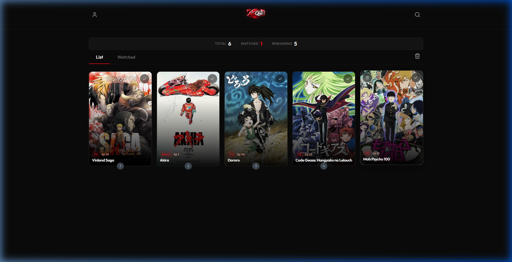

<p align="center">
  
</p>

<p align="center">
  
</p>

<p align="center">
  <strong>A sleek anime watchlist to share with your friends.</strong><br/>
  Track what you're watching, discover new anime, and keep your list organized.
</p>

<p align="center">
  <a href="https://amorish.github.io/anique"></a>
  
  <br/>
  
  
  
</p>

---

##  Features

| Feature | Description |
|---------|-------------|
|  **Secure Auth** | Email/password login & signup with Firebase — smart auto-detection for new users |
|  **Instant Search** | Search 25,000+ anime via the Jikan (MyAnimeList) API with live dropdown results |
|  **Personal Watchlist** | Add, remove, and mark anime as watched — synced to the cloud in real-time |
|  **Google Calendar** | Schedule watch times directly to your Google Calendar |
|  **Random Pick** | Get high quality anime suggestions instantly |
|  **Live Stats** | Track total, watched, and remaining anime at a glance |
|  **Rich Details** | Click any anime card to see synopsis, watch order, director, studio, score, and more |
|  **Filter & Sort** | Quick filter between All / Watching / Watched views |
|  **Password Reset** | Forgot your password? Reset it with one click |
|  **Responsive** | Looks great on desktop, tablet, and mobile |
|  **Premium Dark UI** | Sleek dark theme with Outfit + Inter fonts, video backgrounds, and glassmorphism |

---

##  Screenshots

<details>
<summary><strong>Click to expand</strong></summary>

### Login Screen
> Clean auth overlay with sign in / sign up toggle and forgot password

### Watchlist Grid
> Anime cards with poster art, watched badges, and hover effects

### Anime Details Modal
> Full details with synopsis, watch order, score, studio, and more

</details>

---

##  Quick Start

### 1. Clone the Repo
```bash
git clone https://github.com/amorish/anique.git
cd anique
```

### 2. Set Up Firebase (Free)
1. Go to [Firebase Console](https://console.firebase.google.com/) and create a new project
2. Add a **Web App** and copy the `firebaseConfig`
3. Paste it into `assets/js/app.js` (line 1-9)
4. Enable **Authentication → Email/Password**
5. Enable **Firestore Database**

### 3. Set Firestore Security Rules
Go to Firestore → Rules and paste:
```javascript
rules_version = '2';
service cloud.firestore {
  match /databases/{database}/documents {
    match /watchlists/{userId} {
      allow read, write: if request.auth != null && request.auth.uid == userId;
    }
    match /{document=**} {
      allow read, write: if false;
    }
  }
}
```

### 4. Open & Enjoy
Just open `index.html` in your browser — or deploy for free on GitHub Pages / Netlify / Vercel!

---

##  Tech Stack

| Tech | Purpose |
|------|---------|
| **HTML5 / CSS3 / JS** | Core frontend — zero frameworks, ultra-lightweight |
| **Firebase Auth** | Secure user authentication |
| **Cloud Firestore** | Real-time database for watchlists |
| **Jikan API v4** | Anime data from MyAnimeList |
| **Lucide Icons** | Beautiful SVG icons |
| **Google Fonts** | Outfit (headings) + Inter (body) |

---

##  Project Structure

```
anique/
├── index.html              # Main app entry
├── assets/
│   ├── css/
│   │   └── style.css       # Complete styling (610+ lines)
│   ├── js/
│   │   └── app.js          # App logic, Firebase, search, UI
│   └── images/
│       ├── aniqueTitleLogo.png       # Logo
│       ├── AniQueLogo.svg   # Logo (SVG)
│       └── screenshotDesktop.png       # App screenshot
└── README.md                # Documentation
```

---

##  Security

-  Firebase Authentication with friendly error handling
-  Per-user data isolation (users can only access their own watchlist)
-  XSS protection on all user-facing content
-  Safe-for-work search filter enabled
-  No raw error messages exposed to users
-  Firestore security rules enforce server-side access control

---

##  Roadmap

- [ ] Episode-by-episode progress tracking
- [ ] Personal ratings (1-10 stars)
- [ ] Sort by score, year, name, date added
- [ ] Search within your own watchlist
- [ ] Google Sign-In (one-click login)
- [ ] Statistics dashboard (hours watched, genre breakdown)
- [ ] Friend system & shared watchlists
- [ ] PWA support (install on phone)
- [ ] Light mode toggle
- [ ] Import from MyAnimeList

---

##  Contributing

Contributions are welcome! Feel free to fork and submit a PR.

1. Fork the repo
2. Create your feature branch (`git checkout -b feature/amazing-feature`)
3. Commit your changes (`git commit -m 'Add amazing feature'`)
4. Push to the branch (`git push origin feature/amazing-feature`)
5. Open a Pull Request

---

##  License

This project is open source and available under the [MIT License](LICENSE).

---

<p align="center">
  Created by <a href="https://github.com/amorish">@amorish</a>
</p>
